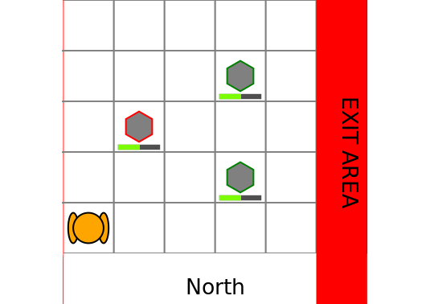

# RockSample.jl 

[](https://travis-ci.org/JuliaPOMDP/RockSample.jl)
[](https://coveralls.io/github/JuliaPOMDP/RockSample.jl?branch=master)
[](https://codecov.io/github/JuliaPOMDP/RockSample.jl)

Implement the RockSample [1] problem with the [POMDPs.jl](https://github.com/JuliaPOMDP/POMDPs.jl) interface. 

[1] T. Smith, R. Simmons, "Heuristic Search Value Iteration for POMDPs," in *Association for Uncertainty in Artificial Intelligence (UAI)*, 2004



## Installation

```julia
using Pkg
Pkg.add("RockSample")
```


## Problem description


- **States**: position of the robot and status of the rocks.

- **Actions**: There are 5 basic actions, moving up, down, left, and right, and sampling a rock and $K$ sensing actions to check the state of a rock. When sampling or sensing, the robot does not move.  

- **Transition model**: When taking a moving action, the robot moves deterministically to the desired cell. The robot can only exit the map by the exit area (on the right side of the grid). Actions that causes the robot to go over the edge of the grid have no effects.

- **Observation model**: The robot can observe the status of the rock with some noise when executing a sensing action. The noise varies exponentially with the distance to the rock. The decaying rate is controlled by the parameter `sensor_efficiency`. If the robot is moving or sampling it does not receive an observation (receives `:none`).

- **Reward model**: At each action, the robot receives a reward of `step_penalty` (negative number). The robot receives a positive reward of `exit_reward` for reaching the exit area. When sampling, the robot receives a reward of `good_rock_reward` if the sampled rock is good or `bad_rock_penalty` (negative number) if the rock is bad. When using the sensor, the robot receives a reward of `sensor_use_penalty` (negative number). The `step_penalty` is additive to the other rewards (e.g. when sampling a good rock, the robot would receive a reward of `step_penalty` + `good_rock_reward`).

### Example

```julia
using POMDPs
using RockSample 
using SARSOP # load a  POMDP Solver
using POMDPGifs # to make gifs
using Cairo # for making/saving the gif

pomdp = RockSamplePOMDP(rocks_positions=[(2,3), (4,4), (4,2)], 
                        sensor_efficiency=20.0,
                        discount_factor=0.95, 
                        good_rock_reward = 20.0)

solver = SARSOPSolver(precision=1e-3)

policy = solve(solver, pomdp)

sim = GifSimulator(filename="test.gif", max_steps=30)
simulate(sim, pomdp, policy)
```


**`RockSamplePOMDP` Parameters:** 

- constructor: `RockSamplePOMDP{K}(kwargs...)` where `K` is an integer representing the number of rocks 
- keyword arguments: 
  - `map_size::Tuple{Int,Int}` the size of the grid, default (5,5)
  - `rocks_positions::Vector{K,RSPos}`, the list of positions of the rocks, default `@SVector[(1,1), (3,3), (4,4)]`
  - `init_pos::RSPos` the initial position of the robot, default (1, 1)
  - `sensor_efficiency::Float64`, the decaying rate of the sensor performance, default 20.
  - `bad_rock_penalty::Float64` default -10.
  - `good_rock_reward::Float64` default 10.
  - `step_penalty::Float64` default 0.
  - `sensor_use_penalty::Float64` default 0.
  - `exit_reward::Float64` default 10.
  - `discount_factor::Float64` default 0.95

**Internal types:**

`RSPos` : represent a position in the grid as a static array of 2 integers.
`RSState`: represent the state of the POMDP. The field `pos::RSPos` is the position of the robots
and the field `rocks::SVector{K, Bool}` represents the status of the rocks (good or bad).
